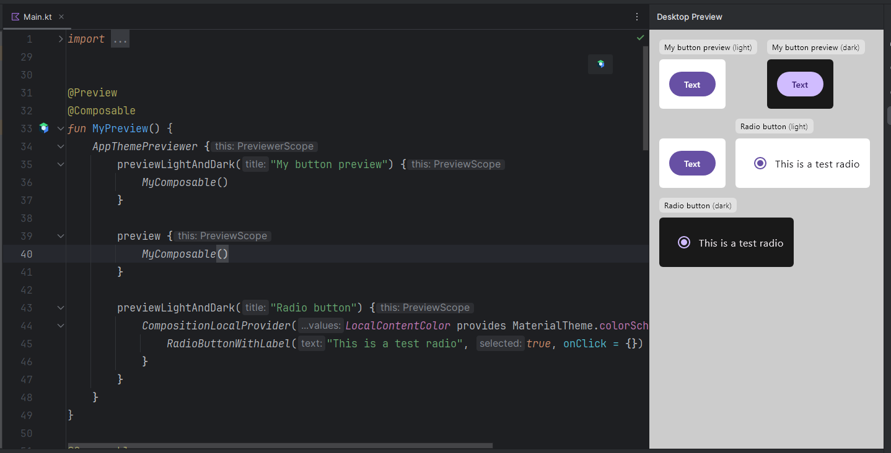

# Compose Desktop Previewer

Composable preview in Compose Desktop + IntelliJ is very limited and kinda sucks, right?

Let's fix that, right now!

## Features

- [x] Support for custom themes and any way you use to customise your app theme.
- [x] DSL for creating previews.
- [x] Sugar-coated functions for creating light and dark previews at once with no boilerplate.
- [x] Modern UI for previews.
- [ ] Show borders and debug information for the previewed view in the preview
  area.
- [ ] Gradle plugin to make previews work automatically by adding
  an annotation to the existing @Preview-annotated composable.

## Usage

Create a wrapper Composable that will setup your own theme for the preview via the `wrapperBlock`:

```kotlin
@Composable
fun AppThemePreviewer(content: PreviewerScope.() -> Unit) {
    Previewer(wrapperBlock = { wrappedContent ->
        // The `previewTheme` property is accessible via the PreviewScope
        // The `wrapperBlock` function will wrap every preview created with this Previewer composable
        
        AppTheme(isDarkModeOverride = previewTheme.isDark) {
            wrappedContent()
        }
    }, content = content)
}
```

And then create a composable function annotated with @Preview, where you will use the 
DSL to create the various previews:

```kotlin

@Preview
@Composable
fun MyPreview() {
    AppThemePreviewer {
        previewLightAndDark("My button preview") {
            MyComposable()
        }

        preview {
            MyComposable()
        }

        previewLightAndDark("Radio button") {
            CompositionLocalProvider(LocalContentColor provides MaterialTheme.colorScheme.onBackground) {
                RadioButtonWithLabel("This is a test radio", true, onClick = {})
            }
        }
    }
}
```

## Screenshots


